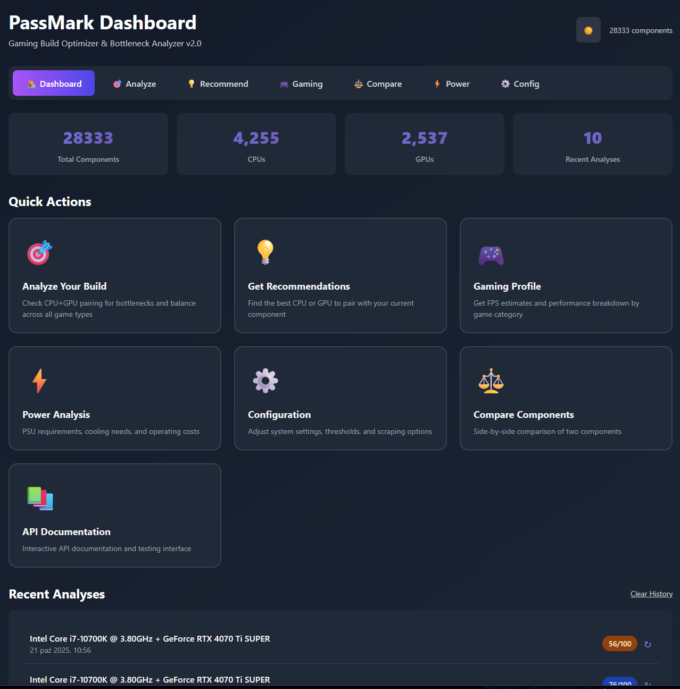
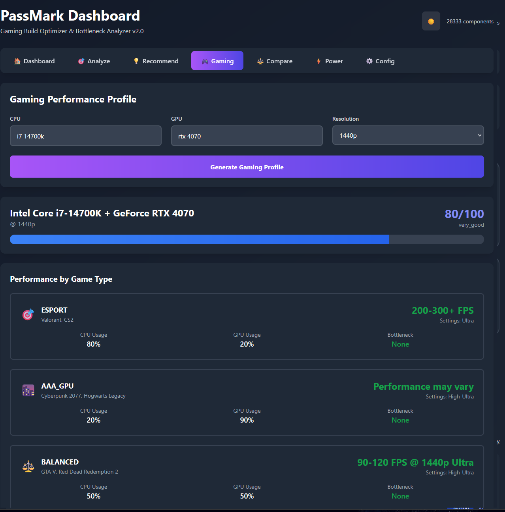
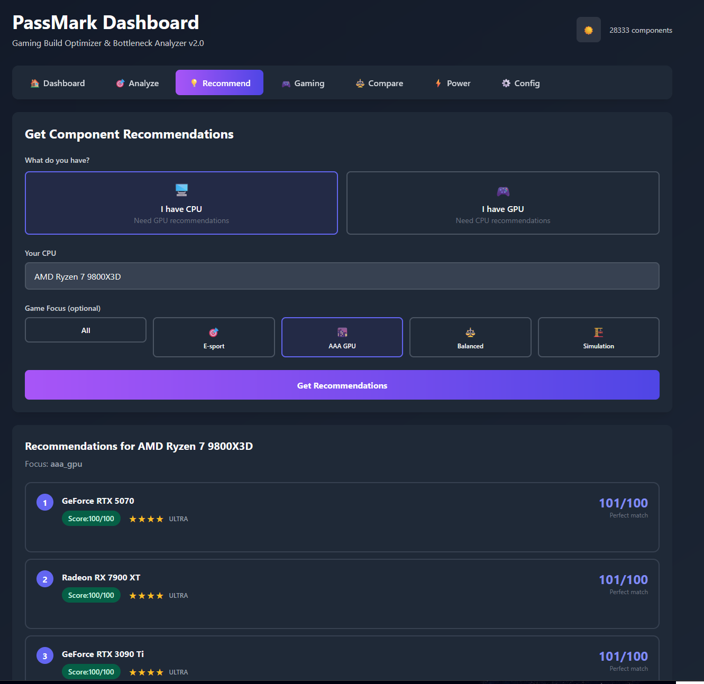
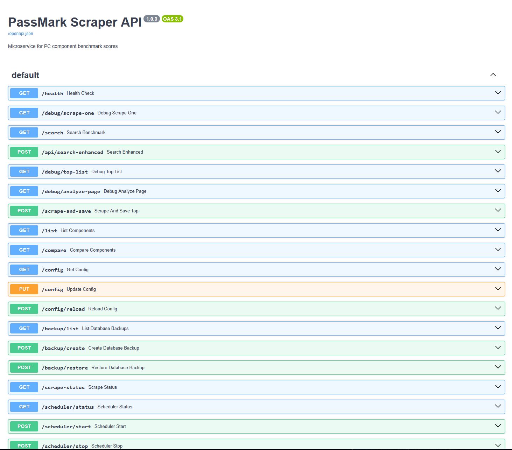

# PassMark Scraper Microservice

[](https://www.python.org/downloads/)
[](https://fastapi.tiangolo.com)
[](https://www.docker.com/)
[](LICENSE)
[](http://localhost:9091/health)

REST API microservice that provides performance benchmark scores for PC components. Data is scraped from PassMark and served via HTTP endpoints with a beautiful web interface for component comparison.

## 🎯 Features

### Core Features
- 🔍 **28,000+ Components** in database (CPU, GPU, RAM, Storage)
- ⚡ **Fast REST API** with component search and comparison
- 🎨 **Beautiful Web UI** for easy component comparison
- 📊 **Normalized Scores** (0-100) for fair comparisons
- 🏆 **Tier System** (low/mid/high/ultra)

### NEW: Gaming & Bottleneck Analysis 🎮
- 🎯 **Intelligent CPU+GPU Pairing** - Analyze bottlenecks for your build
- 🎮 **Game Category Analysis** - E-sport, AAA GPU-heavy, Balanced, Simulation
- 🔄 **Smart Recommendations** - Get optimal component pairings
- 📈 **Performance Estimates** - FPS predictions per game type and resolution
- ⚖️ **Balance Scoring** - 0-100 score for component compatibility
- 🚫 **Minimum Requirements** - Prevents absurd pairings (Threadripper + GTX 1030)
- 📊 **Gaming Profiles** - Complete performance breakdown by game category

### Other Features
- 🔄 **Automatic Scraping** from PassMark with full list support
- 💾 **All DDR Types** (DDR5, DDR4, DDR3, DDR2)
- 🕰️ **Legacy Support** (Pentium 4, Athlon, VIA processors)
- 🐳 **Docker Support** with volume persistence
- 🔧 **Config Management** - Update config via API
- 💾 **Auto-Backup** - Automatic backups before scraping
- 📊 **Progress Tracking** - Real-time scraping progress
- ⏰ **Scheduler** - Automatic weekly scraping
- 📝 **Structured Logging** - Logs to files + console

---

## 🚀 Quick Start

### Using Docker (Recommended)

```bash
# Build and run
docker-compose up --build

# API available at http://localhost:9091
# Web UI at http://localhost:9091
```

### Manual Setup

```bash
# Install dependencies
pip install -r requirements.txt

# Install Playwright browser
playwright install chromium

# Start server
uvicorn app.main:app --port 9091 --reload

# Or use the PowerShell script
.\start_server.ps1
```

---

## 📊 Web Interface

Open http://localhost:9091 in your browser for a beautiful comparison interface.

**Features:**
- Visual component comparison
- Real-time performance difference calculation
- Tier and category display
- Mobile-responsive design

**Example:**
1. Enter "GTX 760A" in Component 1
2. Enter "RTX 3050" in Component 2
3. Click "Compare"
4. See the RTX 3050 is 776% faster! 🚀

---

## 🔌 API Endpoints

### 🆕 Gaming & Recommendation Endpoints

#### `POST /analyze-pairing`
Analyze CPU+GPU pairing for bottlenecks across all game categories.

**Request:**
```bash
curl -X POST http://localhost:9091/analyze-pairing \
  -H "Content-Type: application/json" \
  -d '{"cpu": "Ryzen 7 7800X3D", "gpu": "RTX 4070"}'
```

**Response:**
```json
{
  "cpu": {"name": "AMD Ryzen 7 7800X3D", "tier": "ultra", "normalized_score": 85},
  "gpu": {"name": "GeForce RTX 4070", "tier": "high", "normalized_score": 75},
  "overall_balance_score": 88,
  "overall_verdict": "excellent",
  "overall_bottleneck": null,
  "by_category": {
    "esport": {
      "balance_score": 92,
      "bottleneck": null,
      "performance": "excellent"
    },
    "aaa_gpu": {
      "balance_score": 85,
      "bottleneck": "slight_cpu",
      "performance": "very_good"
    }
  }
}
```

#### `GET /recommend-pairing`
Get component recommendations based on what you have.

**Examples:**
```bash
# I have a CPU, recommend GPUs
curl "http://localhost:9091/recommend-pairing?cpu=7800X3D&game_focus=aaa_gpu&limit=5"

# I have a GPU, recommend CPUs  
curl "http://localhost:9091/recommend-pairing?gpu=RTX4090&game_focus=simulation"
```

**Response:**
```json
{
  "base_component": {"name": "AMD Ryzen 7 7800X3D", "tier": "ultra"},
  "recommendations": [
    {
      "name": "GeForce RTX 4080",
      "match_score": 98,
      "balance_description": "Perfect match"
    },
    {
      "name": "GeForce RTX 4070 Ti",
      "match_score": 95,
      "balance_description": "Excellent balance"
    }
  ]
}
```

#### `POST /gaming-profile`
Get complete gaming performance profile for your build.

**Request:**
```bash
curl -X POST http://localhost:9091/gaming-profile \
  -H "Content-Type: application/json" \
  -d '{"cpu": "7800X3D", "gpu": "RTX4070", "resolution": "1440p"}'
```

**Response:**
```json
{
  "overall_balance_score": 88,
  "overall_verdict": "excellent",
  "performance_by_category": {
    "esport": {
      "games": ["Valorant", "CS2", "LoL"],
      "fps_estimate": "300-500+ FPS",
      "settings": "Ultra",
      "bottleneck": null
    },
    "aaa_gpu": {
      "games": ["Cyberpunk 2077", "Starfield"],
      "fps_estimate": "100-120 FPS @ 1440p Ultra",
      "settings": "Ultra",
      "bottleneck": "slight_cpu"
    }
  },
  "upgrade_recommendations": {
    "priority": "None",
    "reason": "System is well balanced"
  }
}
```

#### `GET /estimate-performance`
Estimate gaming performance for a single component.

**Example:**
```bash
curl "http://localhost:9091/estimate-performance?component=RTX4070&type=GPU"
```

#### `GET /game-categories`
Get list of all game categories with their characteristics.

**Response:**
```json
{
  "categories": {
    "esport": {
      "display_name": "E-sport / CPU-heavy",
      "cpu_importance": "80%",
      "gpu_importance": "20%",
      "examples": ["Valorant", "CS2", "LoL"]
    }
  }
}
```

---

### Main Endpoints

#### `GET /`
Web interface for component comparison

#### `GET /compare`
Compare two components

**Parameters:**
- `component1` (string) - First component name
- `component2` (string) - Second component name
- `type` (string, optional) - Component type (CPU, GPU, RAM, STORAGE)

**Example:**
```bash
curl "http://localhost:9091/compare?component1=i7-2630UM&component2=i9-8950HK&type=CPU"
```

**Response:**
```json
{
  "found": true,
  "winner": "component2",
  "better_by_percent": 2498.0,
  "component1": {
    "name": "Intel Core i7-2630UM @ 1.60GHz",
    "passmark_score": 400,
    "normalized_score": 10,
    "tier": "low"
  },
  "component2": {
    "name": "Intel Core i9-8950HK @ 2.90GHz",
    "passmark_score": 10392,
    "normalized_score": 50,
    "tier": "mid"
  }
}
```

#### `GET /search`
Search for a component in database

**Parameters:**
- `name` (string) - Component name to search
- `type` (string, optional) - Component type

**Example:**
```bash
curl "http://localhost:9091/search?name=RTX+3080&type=GPU"
```

#### `GET /list`
List top components from database

**Parameters:**
- `type` (string) - Component type (CPU, GPU, RAM, STORAGE)
- `limit` (int) - Number of components to return
- `category` (string, optional) - Filter by category (consumer, workstation)

**Example:**
```bash
curl "http://localhost:9091/list?type=GPU&limit=10&category=consumer"
```

#### `GET /health`
Health check endpoint

---

## 🔧 Management Endpoints

### Configuration

#### `GET /config`
View current configuration

#### `PUT /config`
Update configuration (with backup)

#### `POST /config/reload`
Reload config without restart

### Backup

#### `GET /backup/list`
List all database backups

```json
{
  "count": 2,
  "backups": [
    {
      "filename": "benchmarks_20251012_180046.db",
      "size_mb": 7.07,
      "created_at": "2025-10-12T18:00:46"
    }
  ]
}
```

#### `POST /backup/create`
Create manual backup

#### `POST /backup/restore?filename=<name>`
Restore from backup

### Monitoring

#### `GET /scrape-status`
Real-time scraping progress

```json
{
  "is_running": true,
  "component_type": "GPU",
  "progress": { "current": 150, "total": 2785, "percentage": 5.4 },
  "stats": { "saved": 140, "skipped": 10, "errors": 0 }
}
```

#### `GET /scheduler/status`
Scheduler status and next run time

```json
{
  "enabled": true,
  "running": true,
  "next_run": "2025-10-19T03:00:00+00:00"
}
```

#### `POST /scheduler/start` / `POST /scheduler/stop`
Control scheduler

---

## 📦 Database

The microservice uses SQLite database (`benchmarks.db`) with the following structure:

### Current Database Stats:
- **CPU:** 4,255 components (includes Pentium, Celeron, Athlon, FX, mobile, legacy)
- **GPU:** 2,537 components
- **RAM:** 8,648 components (DDR5, DDR4, DDR3, DDR2)
- **STORAGE:** 12,871 components
- **TOTAL:** 28,311 components

### Schema:
```sql
CREATE TABLE component_benchmarks (
    id INTEGER PRIMARY KEY,
    component_name TEXT NOT NULL,
    normalized_name TEXT NOT NULL,
    component_type TEXT NOT NULL,
    category TEXT,
    passmark_score INTEGER NOT NULL,
    normalized_score INTEGER NOT NULL,
    tier TEXT,
    scraped_at TIMESTAMP
);
```

---

## 🔄 Scraping

### Configuration

Edit `config/config.json`:

```json
{
  "scraping": {
    "use_full_lists": true,
    "limits": {
      "cpu": -1,
      "gpu": -1,
      "ram": -1,
      "storage": -1
    },
    "include_workstation": false
  }
}
```

- `use_full_lists: true` - Scrapes ALL components from PassMark (~22k)
- `use_full_lists: false` - Scrapes only high-end lists (~1k)
- `limits: -1` - No limit (scrape all)
- `include_workstation: false` - Excludes workstation components

### Manual Scraping

```bash
# Scrape all component types
python scrape_all.py

# Or use API endpoint
curl -X POST "http://localhost:9091/scrape-and-save?type=CPU&limit=100"
```

---

## 🐳 Docker

### Docker Compose (Recommended)

```yaml
version: '3.8'
services:
  passmark-api:
    build: .
    ports:
      - "9091:9091"
    volumes:
      - ./benchmarks.db:/app/benchmarks.db
      - ./logs:/app/logs
    restart: unless-stopped
```

### Build and Run

```bash
# Build image
docker-compose build

# Run in background
docker-compose up -d

# View logs
docker-compose logs -f

# Stop
docker-compose down
```

### Database Persistence

The database is persisted using Docker volumes:
- `./benchmarks.db` - SQLite database file
- `./logs` - Application logs

---

## 📁 Project Structure

```
PassMarkScraper/
├── app/
│   ├── main.py              # FastAPI application
│   ├── list_scraper.py      # Scraper for full lists
│   ├── scraper.py           # Single component scraper
│   ├── database.py          # SQLite operations
│   ├── normalizer.py        # Score normalization
│   ├── filters.py           # Component filtering
│   ├── models.py            # Pydantic models
│   └── config_loader.py     # Configuration loader
├── static/
│   └── index.html           # Web UI
├── config/
│   └── config.json          # Configuration
├── docs/
│   ├── TUTORIAL.md          # Detailed tutorial
│   └── SPEC.md              # Technical specification
├── benchmarks.db            # SQLite database
├── docker-compose.yml       # Docker Compose config
├── Dockerfile               # Docker image config
├── requirements.txt         # Python dependencies
└── README.md                # This file
```

---

## 🎯 Use Cases

### 1. 🆕 Gaming Build Optimizer
- **"Will my CPU bottleneck this GPU?"** - Get instant analysis
- **"Best GPU for my Ryzen 7800X3D?"** - Smart recommendations based on game type
- **"Can I run Cyberpunk at 1440p Ultra?"** - Performance estimates per game category

### 2. PC Building Assistant
Compare components and get intelligent pairing suggestions for balanced builds.

### 3. Bottleneck Prevention
Avoid common mistakes like pairing i3 with RTX 4090 or Threadripper with GTX 1030.

### 4. Upgrade Advisor
- Current build analysis with upgrade priority
- See which component is holding you back
- Get specific upgrade recommendations

### 5. Performance Benchmarking
Get real-world performance data and FPS estimates for any PC component.

### 6. Market Analysis
Analyze component performance across different price ranges and tiers.

---

## 🔧 Configuration

### Port Configuration

Default port is `9091`. To change:

1. Edit `config/config.json`:
```json
{
  "api": {
    "port": 9091
  }
}
```

2. Update `docker-compose.yml`:
```yaml
ports:
  - "9091:9091"
```

---

## 📈 Performance

- **Search:** ~1-2ms per query (SQLite indexed)
- **Compare:** ~2-5ms per comparison
- **Full scrape:** ~10-15 minutes for all components
- **Database size:** ~5MB for 16k components

---

## 🛠️ Troubleshooting

### Database is empty
Run the scraper to populate the database:
```bash
python scrape_all.py
```

### Port already in use
Change the port in `config/config.json` and restart.

### Docker container won't start
Check logs:
```bash
docker-compose logs
```

### Scraping fails
- Check internet connection
- PassMark might be down
- Increase timeout in `config/config.json`

---

## 📚 Documentation

- **Tutorial:** See [docs/TUTORIAL.md](docs/TUTORIAL.md) for detailed usage guide
- **API Docs:** Visit http://localhost:9091/docs for interactive API documentation
- **Technical Spec:** See [docs/SPEC.md](docs/SPEC.md) for technical details

---

## ⚖️ Legal Notice

This scraper is for **personal and educational use only**. Respect PassMark's Terms of Service. Data is publicly available on PassMark's website. Use responsibly.

---

## 📊 Status

- **Version:** 2.0.0 🆕
- **Status:** Production Ready ✅
- **Database:** 28,311 components (all DDR types, legacy CPUs included)
- **API:** 26 endpoints, fully documented
- **New Features:** Bottleneck analysis, Gaming profiles, Smart recommendations ✅
- **Tests:** 100+ tests passing ✅
- **Docker:** Supported ✅
- **CI/CD:** GitHub Actions ready
- **License:** MIT

---

## 🎨 Screenshots

### 🏠 Main Dashboard
Modern, responsive web interface for component comparison and analysis.



### 🎮 Gaming Profiles & Performance Analysis
Complete gaming performance breakdown by category with FPS estimates and bottleneck detection.



### 🎯 Smart Component Recommendations
Intelligent CPU+GPU pairing recommendations based on your use case and gaming profile.



### ⚡ Power Consumption Analysis
TDP calculations and PSU recommendations for your build.


### 📚 Interactive API Documentation
FastAPI's built-in Swagger UI with all endpoints documented and testable.



---

## 🚀 Future Enhancements

### Already Implemented ✅
- [x] CPU+GPU bottleneck analysis
- [x] Gaming performance profiles
- [x] Intelligent component recommendations
- [x] Multi-category game analysis

### Planned
- [ ] Budget optimizer - "Best build for $1500"
- [ ] Power consumption analysis (TDP)
- [ ] Cooling requirements calculator
- [ ] RAM/Storage impact on performance
- [ ] VR readiness checker
- [ ] Price tracking integration
- [ ] Historical performance trends
- [ ] More component types (Motherboards, PSUs)
- [ ] GraphQL API
- [ ] Export to CSV/JSON

---

## 📧 Support

For issues or questions:
1. Check the [Tutorial](docs/TUTORIAL.md)
2. Review [API Reference](docs/API_REFERENCE.md)
3. See [Examples](docs/EXAMPLES.md)
4. Check API docs at http://localhost:9091/docs
5. Open an [Issue](https://github.com/yourusername/PassMarkScraper/issues)

---

## 🤝 Contributing

We welcome contributions! Please see [CONTRIBUTING.md](CONTRIBUTING.md) for guidelines.

- 🐛 [Report a Bug](.github/ISSUE_TEMPLATE/bug_report.md)
- ✨ [Request a Feature](.github/ISSUE_TEMPLATE/feature_request.md)
- 💻 [Submit a Pull Request](.github/pull_request_template.md)

---

## 🔒 Security

For security issues, please see our [Security Policy](SECURITY.md).

---

## 📄 License

This project is licensed under the MIT License - see the [LICENSE](LICENSE) file for details.

**Data Attribution:** All benchmark data is copyrighted by PassMark Software Pty Ltd.
This software is for personal and educational use only.

---

## 🌟 Acknowledgments

- [PassMark Software](https://www.passmark.com) for benchmark data
- [FastAPI](https://fastapi.tiangolo.com) for the amazing framework
- [Playwright](https://playwright.dev) for web scraping capabilities

---

**Last Updated:** 2025-10-20  
**Version:** 2.0.0  
**License:** MIT  
**Status:** Production Ready ✅  
**New in 2.0:** Gaming analysis, Bottleneck detection, Smart recommendations 🎮
